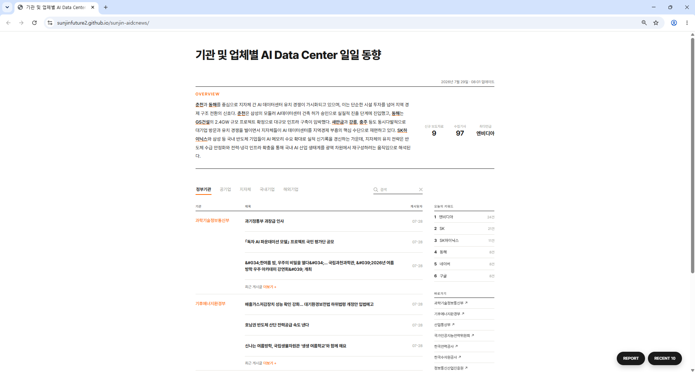
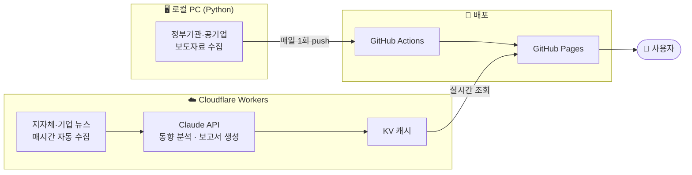
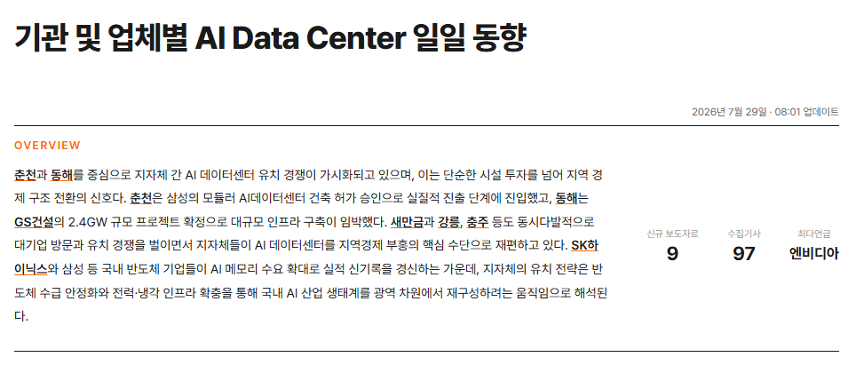
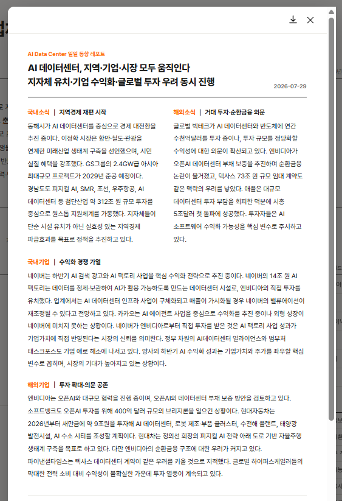
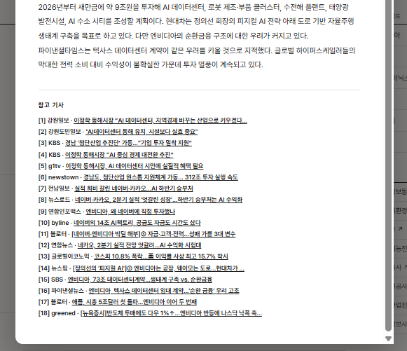
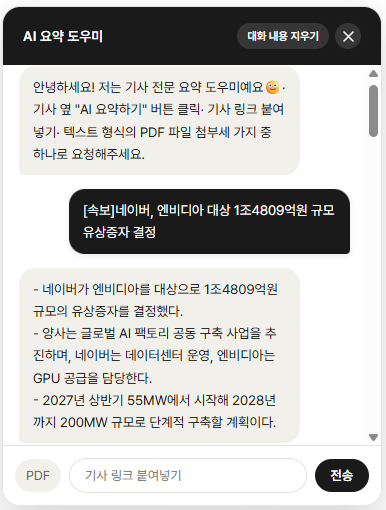
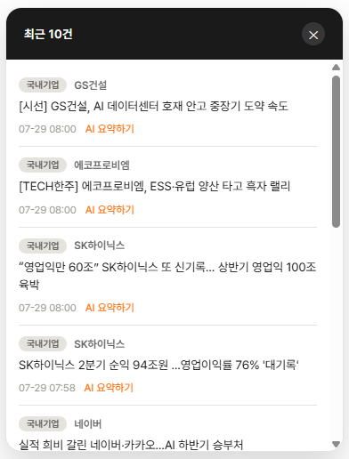
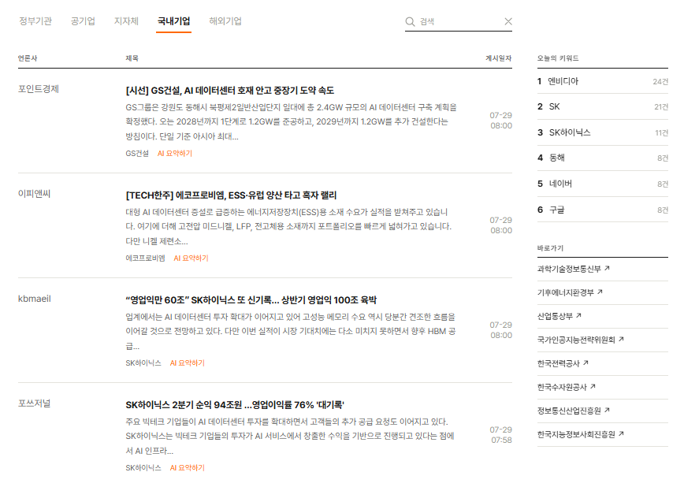

# 🖥️ AI Data Center 산업 동향 자동 수집·분석 시스템

**정부기관·공기업·지자체·기업 뉴스를 매시간 자동 수집하고, AI로 분석·요약하는 실시간 대시보드**

기획 · 백엔드/프론트엔드 개발 · 인프라 구축 · 배포 · 운영 **전 과정 단독 수행**

---

## 📋 목차

- [핵심 성과](#-핵심-성과)
- [프로젝트 개요](#-프로젝트-개요)
- [시스템 구조](#-시스템-구조)
- [내가 맡은 역할](#-내가-맡은-역할)
- [팀에 준 도움](#-팀미래사업전략실에-준-도움)
- [주요 기능](#️-주요-기능)
- [기술적으로 해결한 문제들](#-기술적으로-해결한-문제들)
- [배운 점](#-배운-점)

---

## 🏆 핵심 성과

> - 정부기관 8곳 + 공기업 + 지자체 + 국내외 기업 뉴스를 **완전 자동 수집·분석 파이프라인**으로 구축
> - Claude API를 실제 서비스에 연동 — **동향 분석, 일일 보고서 생성, 2단계 팩트체크 검증**까지 직접 설계
> - 로컬 PC 전원 상태와 무관하게 **24시간 자동 운영**되는 서버리스 인프라 구축
> - 실서비스 운영 중 발생한 **네트워크 차단, 데이터 오분류, 성능 저하** 등을 직접 진단·해결

---

## 📌 프로젝트 개요

AI 데이터센터(AIDC) 산업과 관련된 정부기관·공기업 보도자료, 지자체·국내외 기업 뉴스를 **매시간 자동으로 수집**하고, **AI(Claude)로 동향을 분석·요약**하여 실시간으로 제공하는 웹 서비스입니다. 담당자가 여러 사이트를 일일이 확인하던 업무를, 하나의 대시보드에서 확인할 수 있는 형태로 전환했습니다.

  
   사이트 메인 화면 — 헤더, OVERVIEW, 탭 배너

---

## 🧭 시스템 구조

데이터 수집 대상의 특성에 따라 처리 위치를 이원화했습니다. 정부기관 사이트는 클라우드 IP를 차단하는 경우가 많아 **로컬 환경**에서, 실시간성이 중요한 데이터는 **서버리스 환경**에서 처리합니다.

| 구성 요소 | 역할 |
|---|---|
| 로컬 배치(Python) | 정부기관·공기업 보도자료 수집 (WAF 우회 목적) |
| Cloudflare Worker | 지자체·기업 뉴스 수집, AI 동향 분석, 일일 보고서 자동 생성 — 매시간 |
| GitHub Pages | 완성된 결과물을 실시간 웹사이트로 배포 |

---

## 🙋 내가 맡은 역할

이 프로젝트는 **기획부터 배포, 운영까지 전 과정을 혼자 담당**했습니다.

- 데이터 수집 대상(정부기관 8곳, 공기업, 지자체, 국내외 기업)을 조사하고 수집 전략 설계
- Python 기반 스크래핑 로직 설계 및 구현
- Cloudflare Workers 기반 서버리스 인프라 구축 (Cron 자동화, KV 캐시 설계)
- Claude API 연동 — 동향 분석문 생성, 일일 보고서 생성, AI 요약 챗봇 기능 구현
- 프롬프트 설계 및 반복 개선, 팩트체크(2단계 검증) 로직 직접 설계
- 프론트엔드 UI/UX 설계 및 반복 개선
- 실제 운영 중 발생한 장애(네트워크 차단, 데이터 중복·오분류, 성능 저하 등) 직접 진단·해결

---

## 🤝 팀(미래사업전략실)에 준 도움

- 여러 정부기관·공기업 사이트를 수기로 확인하던 업무를 **하나의 대시보드**로 통합
- 매일 오전 자동 생성되는 **일일 동향 보고서**로, 출근 직후 전날 밤사이 동향을 즉시 파악 가능하게 함
- **검색·키워드 필터링** 기능으로 특정 지역·기업 관련 정보를 빠르게 찾을 수 있도록 지원
- **PDF 다운로드** 기능으로 필요 시 팀 내 다른 구성원에게 손쉽게 자료 공유 가능
- 특정 인원의 PC 실행 여부와 무관하게 **24시간 자동 운영**되는 시스템을 구축하여 업무 종속성 해소

---

## ⚙️ 주요 기능

### OVERVIEW — 실시간 AI 동향 분석
매시간 최신 데이터를 바탕으로 AI가 자동으로 작성하는 동향 분석문입니다. 언급된 지역·기업명은 자동으로 밑줄 처리되어 클릭 시 관련 기사만 필터링됩니다.

### REPORT — 일일 동향 보고서
매일 오전 8시, 전날 하루 동안의 뉴스를 바탕으로 국내소식·해외소식·국내기업·해외기업 4개 섹션으로 나눠 AI가 자동 작성하고, 참고 기사 링크까지 함께 제공합니다. PDF로도 다운로드할 수 있습니다.

  
  

### AI 요약 도우미
기사 링크나 PDF 파일을 첨부하면 실시간으로 요약해주는 챗봇입니다. 드래그 앤 드롭을 지원하고, 대화 이력은 브라우저에 자동 저장됩니다.

### 검색 및 필터링
지자체·국내기업·해외기업 통합 검색, 키워드 클릭 필터링, 최근 10건 통합 보기를 지원합니다. 각 기사마다 "AI 요약하기" 버튼으로 바로 요약을 받아볼 수 있습니다.

  
  

---

## 🔧 기술적으로 해결한 문제들

<b>① 클라우드 IP 차단 대응</b>

 

정부기관 웹사이트가 GitHub Actions 등 클라우드 서버의 접속을 방화벽(WAF) 차원에서 차단하는 것을 확인하고, 해당 수집 로직만 로컬 환경으로 이전하여 안정성을 확보했습니다. 이후 Cloudflare에서 Anthropic API 호출 시에도 동일한 유형의 403 차단이 발생하는 것을 재확인하고, Cloudflare AI Gateway를 경유하는 우회 경로를 구축했습니다.

<b>② 데이터 중복·오분류 문제 해결</b>

 

동일 기사가 지자체·국내기업·해외기업 세 카테고리에 중복으로 노출되는 문제를 발견했습니다. 링크 기준 전역 중복 제거 로직과, 텍스트 내 언급 빈도 기반 우선순위 배정 알고리즘을 설계·구현했습니다.

또한 "대전"과 "대전환"처럼 단순 문자열 포함 검사로는 걸러지지 않는 오분류 문제를, 한국어 조사·행정구역 접미사 경계를 인식하는 매칭 로직을 직접 설계해 해결했습니다.

<b>③ AI 생성 콘텐츠의 신뢰도 확보</b>

 

AI가 사실과 다른 내용(인물 직함 오기, 연도 오기 등)을 생성하는 문제를 발견하고, 초안을 원본 자료와 대조해 교정하는 2단계 팩트체크 검증 로직을 직접 설계·구현했습니다.

<b>④ 성능 및 비용 최적화</b>

 

순차적으로 실행되던 API 호출을 병렬화하고, 반복 호출되던 참고자료를 통합 요청으로 묶어 실행 시간과 토큰 사용량을 동시에 절감했습니다.

---

## 💡 배운 점

실제 서비스 환경에서는 데이터가 이상적인 형태로 주어지지 않는다는 것을 체감했습니다. 같은 정보라도 소스마다 형식이 다르고, 하나의 데이터가 여러 카테고리에 동시에 해당될 수 있는 모호성은 규칙 하나로 해결되지 않으며, 실제 데이터를 관찰하며 기준을 정교화하는 반복적인 과정이 필요하다는 것을 배웠습니다.

네트워크 차단, 외부 API 연동 오류 등을 직접 진단하면서, 증상만으로 원인을 단정하지 않고 요청과 응답을 하나씩 검증하며 근본 원인을 찾아가는 체계적인 디버깅 접근을 체득했습니다.

또한 AI를 실제 제품에 연동할 때는 "그럴듯한 결과"와 "신뢰할 수 있는 결과"가 다르다는 것을 깨달았고, 이를 보완하기 위한 검증 장치를 직접 설계해보며 AI 활용 제품 개발에서의 품질 관리 감각을 기를 수 있었습니다.

---

🔗 **Live Demo**: [sunjinfuture2.github.io/sunjin-aidcnews](https://sunjinfuture2.github.io/sunjin-aidcnews/)

