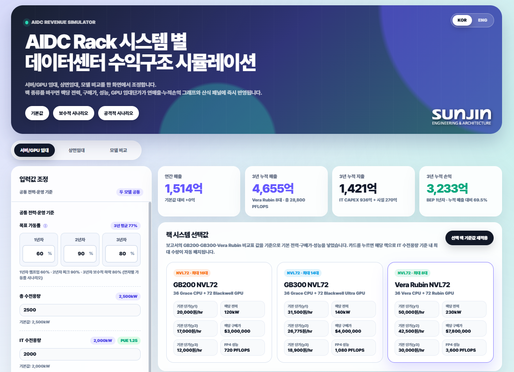
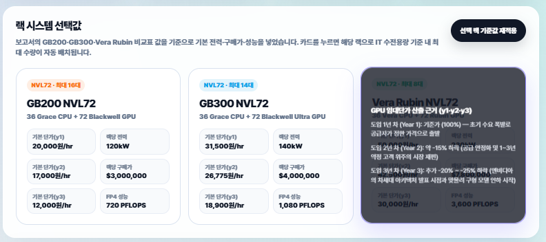
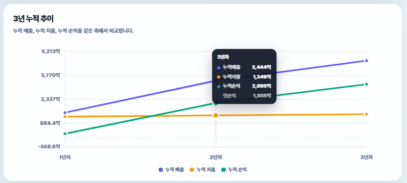

# 🧮 AIDC Revenue Simulator

<div align="center">

**AI 데이터센터 사업의 3개년 수익 구조를 실시간으로 시뮬레이션하는 인터랙티브 웹 도구**


</div>

## 📌 개요

AI 데이터센터 사업(GPU 임대·상면임대)의 예상 수익·비용·손익을 **입력값 조정만으로 즉시 시뮬레이션**할 수 있는 단일 페이지 웹 애플리케이션입니다. 외부 라이브러리나 프레임워크 없이 순수 HTML/CSS/JavaScript로 처음부터 직접 구현했습니다.

<p align="center">
  
</p>

## ⚙️ 핵심 기능

- **두 가지 사업 모델 비교**: GPU 임대(GPUaaS) vs 상면임대(Colocation)
- **랙 시스템 3종 비교**: GB200 / GB300 / Vera Rubin NVL72 — 전력, 구매가, 연차별 GPU 임대단가, 성능(FP4 PFLOPS)을 실제 스펙 기준으로 반영
- **실시간 재계산**: 가동률, 전력 용량, 시설 CAPEX, 전기요금, 환율 등 모든 입력값이 바뀌는 즉시 매출·비용·손익 그래프에 반영
- **신축 vs 리모델링 비교**: 시설 항목별(전력·공조·건축·통신·설계) 원가를 분리해, 리모델링 시 정확히 어디서 얼마나 절감되는지 근거까지 함께 제시
- **3개 시나리오 프리셋**: 기본값 / 보수적 / 공격적 시나리오를 원클릭으로 전환
- **커스텀 SVG 차트**: 차트 라이브러리 없이 SVG로 직접 구현한 3개년 누적 추이 그래프, 호버 시 정확한 수치 툴팁 제공
- **한/영 이중언어 지원**: 통화 단위(억원 ↔ $M/B)까지 자동 환산되는 완전한 i18n 처리
- **CSV 내보내기**: 계산 결과를 연차별 표로 다운로드

<p align="center">
  
  
</p>

## 🧠 기술적으로 신경 쓴 부분

<details>
<summary><b>산식의 투명성 — "왜 이 숫자가 나왔는지" 항상 보여주기</b></summary>
<br/>

단순히 결과 숫자만 보여주는 게 아니라, 화면 하단에 **실제 계산에 사용된 산식과 그 시점의 기준값**을 항상 함께 노출하도록 설계했습니다. 사용자가 결과를 신뢰하고, 어떤 변수를 조정하면 결과가 어떻게 바뀔지 예측할 수 있게 하기 위함입니다.
</details>

<details>
<summary><b>전력 용량 기준 자동 제약(Auto-capping) 로직</b></summary>
<br/>

랙 수량을 늘릴 때, IT 전력 용량(kW)을 초과하지 않도록 항상 자동으로 상한을 재계산합니다. 특정 랙의 전력 스펙을 바꾸면 이미 배치된 다른 랙 수량까지 연쇄적으로 재조정되는 로직을 직접 구현했습니다.
</details>

<details>
<summary><b>순수 SVG 기반 인터랙티브 차트</b></summary>
<br/>

Chart.js 같은 외부 라이브러리에 의존하지 않고, SVG 좌표 계산부터 호버 감지 영역(hover-zone), 툴팁 위치 자동 보정까지 직접 구현했습니다. 데이터 값 범위에 따라 축 눈금이 자동으로 재계산되도록 처리했습니다.
</details>

<details>
<summary><b>단위 환산 일관성 처리(한글 억원 ↔ 영어 $M/B)</b></summary>
<br/>

내부 상태값은 항상 원화(억원) 기준으로 유지하면서, 언어 전환 시에만 환율을 적용해 화면에 보여주는 표시값만 변환되도록 분리 설계했습니다. 이를 통해 언어를 오갈 때마다 값이 미세하게 틀어지는 부동소수점 오차 누적 문제를 방지했습니다.
</details>

## 🔗 라이브 데모

이 프로젝트는 순수 정적 파일(HTML/CSS/JS만 사용, 서버 불필요)이라 **GitHub Pages로 바로 무료 배포**할 수 있어요.

1. 저장소 → Settings → Pages → Source를 "GitHub Actions" 또는 "Deploy from a branch"로 설정
2. `projects/revenue-simulator/index.html`이 포함된 폴더를 배포 대상으로 지정
3. 배포 완료 후 아래 형태의 주소로 접속 가능:
   ```
   https://[깃허브계정].github.io/[저장소명]/projects/revenue-simulator/
   ```

> 🔗 **Live Demo**: _(배포 후 이 자리에 실제 주소를 넣어주세요)_
